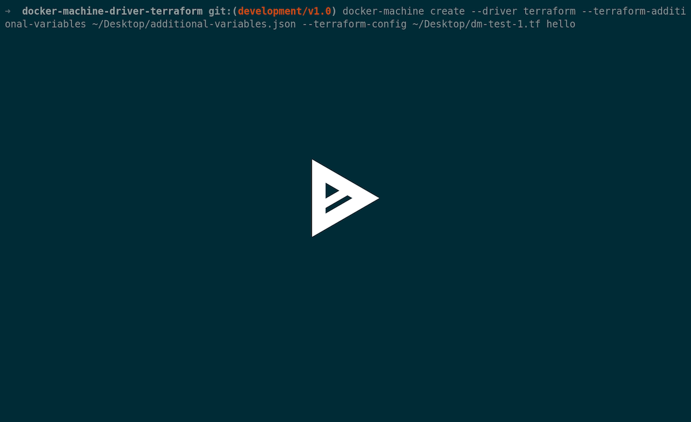

# Terraform driver for Docker Machine

Do you use Docker Machine?
Do you sometimes wish you had a little more control over the infrastructure it creates?

Well now you do :)

If you can express it as a Terraform configuration, you can use it from Docker Machine.

### Arguments

The driver accepts the following arguments:

* `--terraform-config` (Required) - The path (or URL) of the Terraform configuration to use
* `--terraform-variable` (Optional) - One or more items of the form "name=value" representing additional variables for the Terraform configuration  
For example: `--terraform-variable variable1=foo --terraform-variable variable2=bar`
* `--terraform-variables-from` (Optional) - An optional file containing the JSON that represents additional variables for the Terraform configuration
* `--terraform-refresh` (Optional) - A flag which, if specified, will cause the driver to refresh the configuration after applying it

### Terraform configuration

The driver can work with a Terraform configuration in any of the following formats:

* A single local .tf file
* A single local .zip file containing 1 or more .tf files
* A local directory containing 1 or more .tf files
* A single remote .tf file (using HTTP)
* A single remote .zip file containing 1 or more .tf files (using HTTP)

It will supply the following values to the configuration as variables (in addition to any supplied via `--terraform-variables-file`):

* `dm_client_ip` - The public IP of the client machine (useful for configuring firewall rules)
* `dm_machine_name` - The name of the Docker machine being created
* `dm_ssh_user` - The SSH user name to use for authentication
* `dm_ssh_port` - The SSH port to use
* `dm_ssh_public_key_file` - The public SSH key file to use for authentication
* `dm_ssh_private_key_file` - The private SSH key file to use for authentication
* `dm_onetime_password` - An optional one-time password that can be used for scenarios such as bootstrapping key-based SSH authentication

It expects the following [outputs](https://www.terraform.io/docs/configuration/outputs.html) from Terraform:

* `dm_machine_ip` (Required) - The IP address of the target machine
* `dm_machine_ssh_username` (Optional) - The SSH user name for authentication to the target machine  
If specified this overrides the variable of the same name that was passed in

#### Examples

Here are some [examples](examples) for several different providers:

* [Digital Ocean](examples/digital_ocean)
* [Dimension Data CloudControl](examples/ddcloud)
  * [Public IP](examples/ddcloud/public_ip)
  * [Private IP](examples/ddcloud/private_ip)
* [Amazon Web Services (AWS)](examples/aws)
* Azure  
Still to be implemented

## Installing the driver

Download the [latest release](https://github.com/tintoy/docker-machine-driver-terraform/releases) and place the provider executable in the same directory as `docker-machine` executable (or somewhere on your `PATH`).

## Building the driver

If you'd rather run from source, run `make dev` and then `source ./use-dev-driver.sh`. You're good to go :)

See [CONTRIBUTING.md](CONTRIBUTING.md) for more detailed information about building / modifying the driver.
